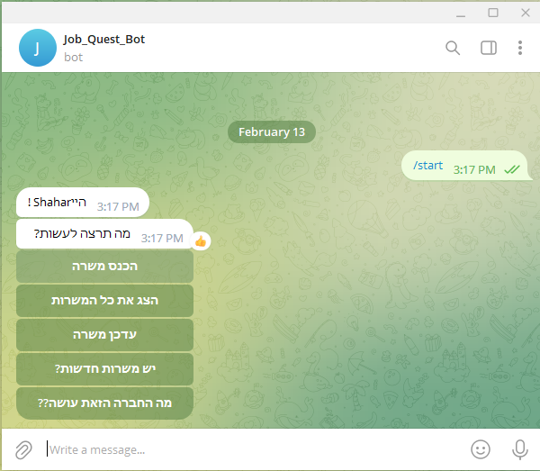
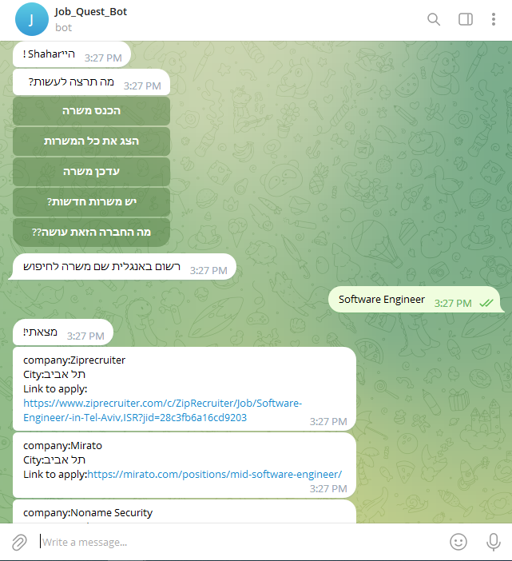
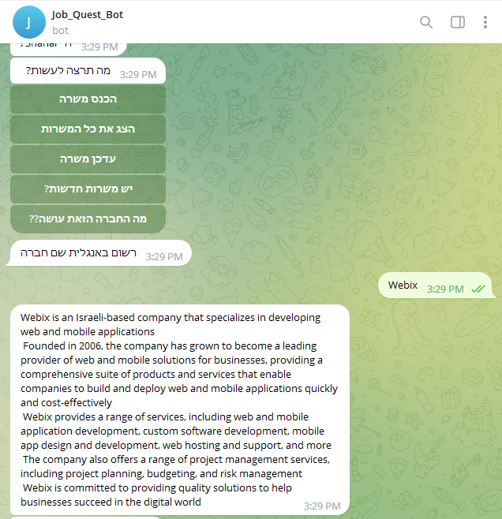
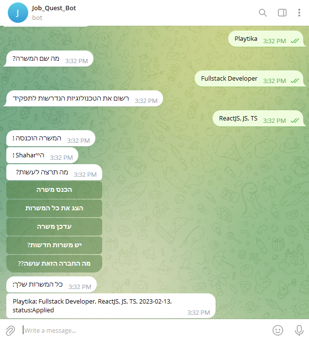

# Job Quest Bot

## The Team
- Barr Grace
- Shahar Meshulam
- Shahaf Pinto

## About this bot

- Our bot purpose is to help the user manage his job search process, 
helping him to keep track of his applications, find relevant jobs and
get information about companies.

- Link to the bot : http://t.me/Job_Quest_bot

#### Menu

#### Job Search

#### Find information about a company

#### Manage your applications

#### This is a work in progress, features to be added:
- [x] Show new relevant jobs to the user by title and location
- [x] Add a feature that allows the user to easily acquire information about a company
- [ ] Add the option to update why a job was rejected and add the feedback received if any
- [ ] Add relevant jobs from more websites with more filters
- [ ] Export user's data to excel file
 
## Instructions for Developers 
### Prerequisites
- Python 3.10
- Poetry
- MongoDB
- Telegram account

### Setup
- git clone this repository 
- cd into the project directory
- Install dependencies:
    
      poetry install

- Get an API Token for a bot via the [BotFather](https://telegram.me/BotFather)
- Create a `bot_settings.py` file with your bot token:

      BOT_TOKEN = 'xxxxxxx'

### Running the bot        
- Run the bot:

      poetry run python bot.py
